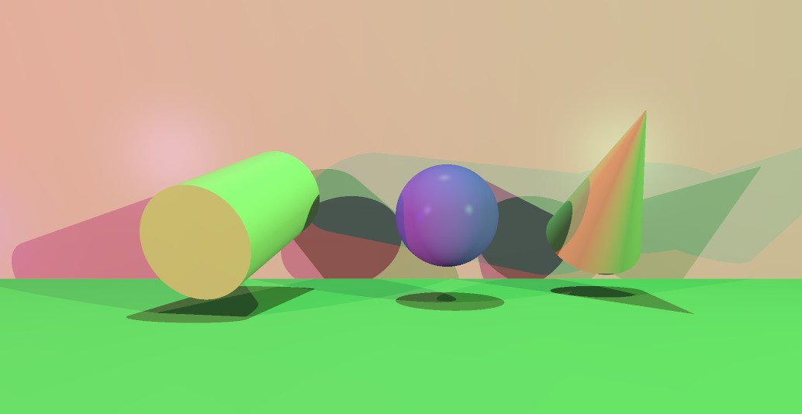

# miniRT

> A ray tracer built from scratch in C — no engine, just math and rays.



## Overview

**miniRT** is a software ray tracer implementing the fundamentals of physically-based rendering: ray-object intersection, Phong shading, hard shadows, and a configurable camera — all written in C using MiniLibX for window output.

It supports real-time preview with dynamic quality control: switch between a fast downsampled draft and a high-quality upsampled render without leaving the window.

---

## Usage

```bash
./minirt file.rt
```

The scene is described in a `.rt` file specifying objects, materials, lights, and camera setup. Once loaded, the window opens and rendering begins immediately.

---

## Features

### Phong Shading

Surfaces are lit using the Phong reflection model: ambient base, diffuse response to light angle, and specular highlights. Hard shadows are cast by testing occlusion between each surface point and each light source.

### Dynamic Camera

Position, orientation, and field of view are fully configurable from the `.rt` scene file. The camera can be moved and reoriented interactively — useful for framing shots and exporting new scene files.


### Downsampling — Fast Preview

One ray is cast per block of pixels; the block is filled with the sampled color. Dramatically speeds up rendering for navigation and composition checks.

Toggle with `d`. Adjust block size with `Page Up` / `Page Down`.


### Upsampling — Anti-Aliasing

Additional rays are cast at sub-pixel offsets and averaged per pixel. Smooths edges on curved surfaces and shadow boundaries.

Toggle with `a`. Adjust sample rate with `z` (increase) / `e` (decrease).


### BVH — Bounding Volume Hierarchy

Intersection tests are accelerated using a BVH tree, reducing the number of ray-object tests needed per frame. Visualize the bounding boxes with `t`.

---

## Controls

### Render Quality

| Key | Action |
|-----|--------|
| `a` | Toggle anti-aliasing (upsampling) |
| `z` / `e` | Increase / decrease upsampling rate |
| `d` | Toggle downsampling |
| `Page Up` / `Page Down` | Increase / decrease downsampling block size |

### Camera

| Key | Action |
|-----|--------|
| `+` (numpad) | Increase field of view |
| `-` (numpad) | Decrease field of view |
| `=` | Increase zoom speed |
| `-` | Decrease zoom speed |
| `Backspace` | Enable fast zoom |

### Debug & Export

| Key | Action |
|-----|--------|
| `c` | Print current camera setup |
| `r` | Print current render setup |
| `t` | Toggle BVH bounding box display |
| `m` | Export current view to `./scene/export/*.rt` |

---

## Scene File Format

```
# Camera
C  0,0,-5    0,0,1    70

# Ambient light
A  0.2       255,255,255

# Light source
L  -40,50,0  0.6      255,255,255

# Sphere
sp 0,0,5     2        255,0,0

# Plane
pl 0,-1,0    0,1,0    100,200,100

# Cylinder
cy 0,0,5     0,1,0    1  3  0,0,255

# Cone
co 0,0,5     0,1,0    1  3  0,0,255
```

---

## Build

```bash
make
```

Requires MiniLibX (automatically download) and a working X11 environment (Linux).

---
